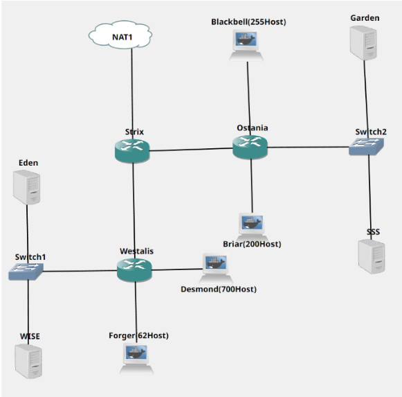
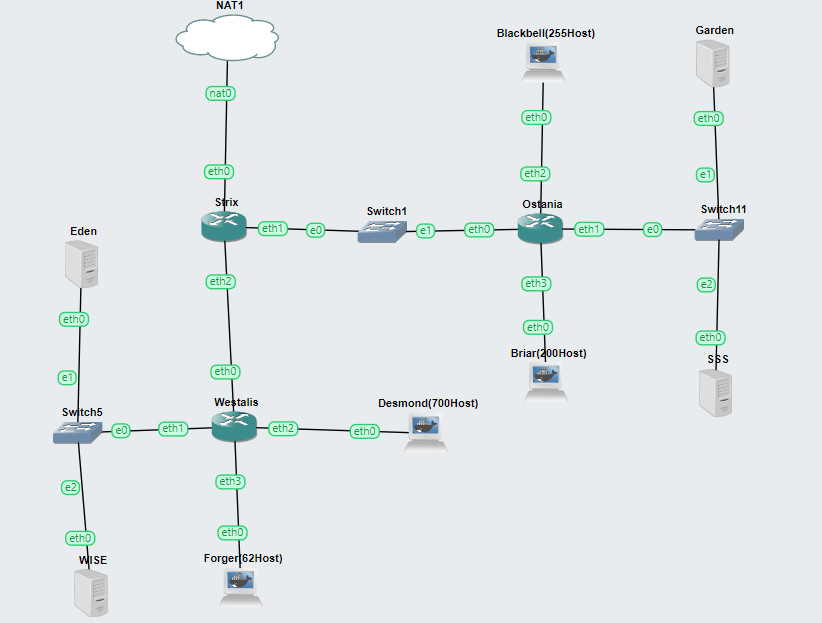
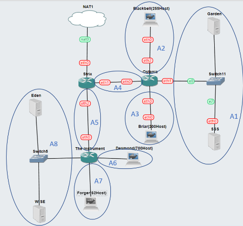

# Jarkom-Modul-5-ITB03-2022
---
Kelompok ITB03:
1. Haffif Rasya Fauzi - 5027201002 (Kontribusi 50%)
2. M. Hilmi Azis - 5027201049 (Kontribusi 0%)
3. Gennaro Fajar Mende - 5027201061 (Kontribusi 50%)
---

## Soal
---
(A) Tugas pertama kalian yaitu membuat topologi jaringan sesuai dengan rancangan yang diberikan Loid dibawah ini



Keterangan:

	-Eden adalah DNS Server

	-WISE adalah DHCP Server

	-Garden dan SSS adalah Web Server

	-Jumlah Host pada Forger adalah 62 host

	-Jumlah Host pada Desmond adalah 700 host

	-Jumlah Host pada Blackbell adalah 255 host

	-Jumlah Host pada Briar adalah 200 host

(B) Untuk menjaga perdamaian dunia, Loid ingin meminta kalian untuk membuat topologi tersebut menggunakan teknik CIDR atau VLSM setelah melakukan subnetting.

(C) Anya, putri pertama Loid, juga berpesan kepada anda agar melakukan Routing agar setiap perangkat pada jaringan tersebut dapat terhubung.

(D) Tugas berikutnya adalah memberikan ip pada subnet Forger, Desmond, Blackbell, dan Briar secara dinamis menggunakan bantuan DHCP server. Kemudian kalian ingat bahwa kalian harus setting DHCP Relay pada router yang menghubungkannya.


## Jawab

Berikut ini adalah topologi yang telah kelompok kami buat:



Untuk subnetting yang kami gunakan adalah VLSM dengan pembagian ip seperti berikut ini



Berikut ini adalah konfigurasi network pada setiap node

[Strix]
```
auto eth0
iface eth0 inet dhcp

# Static config for eth1
auto eth1
iface eth1 inet static
	address 10.47.7.253
	netmask 255.255.255.252

auto eth2
iface eth2 inet static
	address 10.47.7.249
	netmask 255.255.255.252
```

[Westalis]
```
auto eth0
iface eth0 inet static
	address 10.47.7.250
	netmask 255.255.255.252

auto eth1
iface eth1 inet static
	address 10.47.7.241
	netmask 255.255.255.248

auto eth2
iface eth2 inet static
	address 10.47.0.1
	netmask 255.255.252.0

auto eth3
iface eth3 inet static
	address 10.47.7.129
	netmask 255.255.255.192
```

[Ostania]
```
auto eth0
iface eth0 inet static
	address 10.47.7.254
	netmask 255.255.255.252

auto eth1
iface eth1 inet static
	address 10.47.7.225
	netmask 255.255.255.248

auto eth2
iface eth2 inet static
	address 10.47.4.1
	netmask 255.255.254.0

auto eth3
iface eth3 inet static
	address 10.47.6.1
	netmask 255.255.255.0
```

[Eden]
```
auto eth0
iface eth0 inet static
	address 10.47.7.242
	netmask 255.255.255.248
	gateway 10.47.7.241
```

[WISE]
```
auto eth0
iface eth0 inet static
	address 10.47.7.243
	netmask 255.255.255.248
	gateway 10.47.7.241
```

[Garden]
```
# A9
auto eth0
iface eth0 inet static
	address 10.47.7.226
	netmask 255.255.255.248
	gateway 10.47.7.225
```

[SSS]
```
# A9
auto eth0
iface eth0 inet static
	address 10.47.7.227
	netmask 255.255.255.248
	gateway 10.47.7.225
```

[Blackbell] [Briar] [Desmond] [Forger]
```
auto eth0
iface eth0 inet dhcp
```

Dibawah ini adalah setting Router agar semua rute dapat terhubung

Pada Router Westalis dimasukkan kode berikut ini untuk rutenya dan DHCP Relaynya

Pada Router Ostania dimasukkan kode berikut ini untuk rutenya dan DHCP Relaynya

Untuk DHCP Server (WISE) di-setting

Untuk DNS Server (Eden) di-setting

Untuk Web-server (SSS dan Garden) di-setting seperti berikut ini

Jika dibuka webnya akan terlihat nama hostnya

Hasilnya semua node dapat ping dengan sesama
